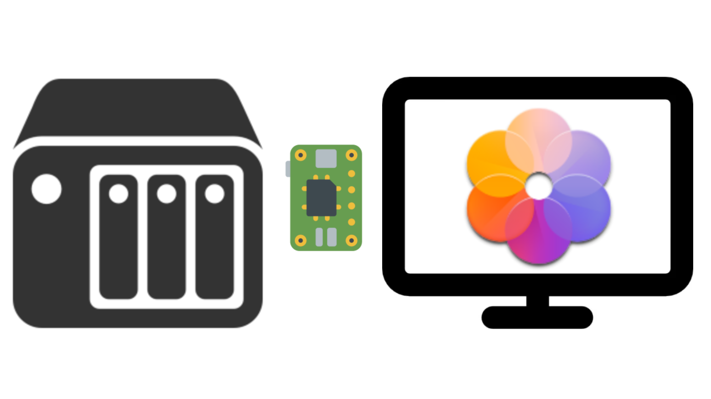
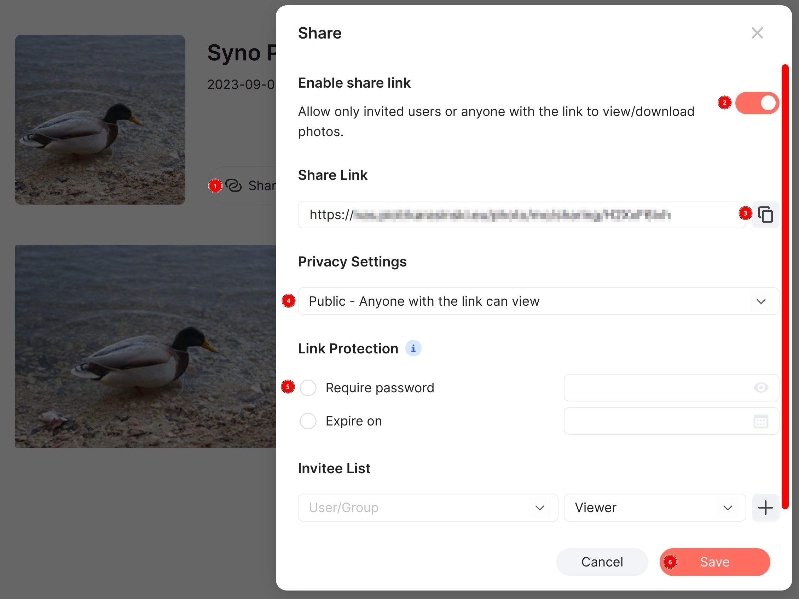

# Syno Photo Frame

[Synology
Photos](https://www.synology.com/en-global/dsm/feature/photos)
full-screen slideshow for Raspberry Pi.



Features speed control, fade-transition effect and blurry background
fill.


## What?

I wrote this code for a DIY digital photo frame project using
Raspberry Pi connected to a monitor (runs great on Pi Zero 2). The
goal was to fetch photos directly from my Synology NAS over LAN.

Why not use Synology Photos in a web browser directly? There are two
reasons. First, current version of Synology Photos (1.5.0 at the time
of writing) does not allow slideshow speed adjustments, and changes
photo every 3 or 4 seconds - way too fast for a photo frame. Second,
running a full www browser is much more resource demanding than a
simple console app, which matters when using Raspberry Pi, especially
in its Zero variant.


### Security Disclaimer

Since I am running all of this over local area network at home only,
security is not a priority for me. You should take extra steps which
are out of scope of this guide if you plan to access your NAS over
Internet, or if you're running this setup in an un-trusted LAN
(e.g. in an office or a dorm).


## Synology Photos Setup

Assuming Synology Photos package is installed on DSM

1. Create an album in Synology Photos and add photos to it
2. Click "Share" icon in the Album
3. Check "Enable share link" option
4. Set Privacy Settings to "Public - Anyone with the link can view"
5. Do NOT enable Link Protection - support for password protection
   might get implemented in the future, for now the assumption is that
   the NAS and Pi are on the same *private* LAN.
7. Copy the Share Link somewhere - you'll need it when running the
   slideshow app on Raspberry Pi
6. Click Save




## Raspberry Pi Setup

The assumption is that you are starting with a fresh installation of
Raspberry Pi OS Lite, network has been set up (so you can access the
Synology NAS) and you have command line access to the Pi.


### 1. Install

Update the system

```
sudo -- sh -c ' \
apt update && \
apt upgrade -y'
```

[Releases](https://github.com/Caleb9/syno-photo-frame/releases)
contains pre-built .deb package for aarch64 Linux target, which should work
on Raspberry Pi 3 and up, as well as Zero 2 (assuming 64bit version of
Raspbian OS is installed). For other platforms you must build the
project yourself - see [Building From Source](#building-from-source).

Download the `syno-photo-frame_X.Y.Z_arm64.deb` package from Releases.

`cd` to directory where the package has been downloaded and install
with

```
sudo apt install ./syno-photo-frame_X.Y.Z_arm64.deb
```

### 2. Run

Display help message:
```
syno-photo-frame --help
```

Run the app:
```
syno-photo-frame {sharing link to Synology Photos album}
```

If everything works as expected, press Ctrl-C to kill the app.


## Building From Source

[Install Rust](https://www.rust-lang.org/tools/install) if you have
not already.

Install build dependencies:
```
sudo -- sh -c ' \
apt update && \
apt upgrade -y && \
apt install -y \
	libsdl2-dev \
	libssl-dev'
```

Install the app from [crates.io](https://crates.io/crates/syno-photo-frame):
```
cargo install syno-photo-frame
```

The binary is then located at `$HOME/.cargo/bin/syno-photo-frame` and
should be available on your `$PATH`.

Alternatively, clone the git repository and build the project with:
```
cargo build --release
```

The binary is then located at `target/release/syno-photo-frame`.


## Optional Stuff

### Increase swap size on Raspberry Pi Zero

100 MB swap file may be too small when running on low memory systems
such as Pi Zero. See [Increasing Swap on a Raspberry
Pi](https://pimylifeup.com/raspberry-pi-swap-file/).


### Auto-start

To start the slideshow automatically on boot, you can add it to crontab:
```
crontab -e
```
Add something like this at the end of crontab:
```
@reboot    sleep 5 && /bin/syno-photo-frame https://{share_link} >> /tmp/syno-photo-frame.log 2>&1
```

Remember to replace your share link with a real one, and adjust the
binary path depending on installation method (dpkg or from
crates.io). Short `sleep` is required to not start before some
services (network) are up - try to increase it if errors occur. The
above command redirects error messages to a log file
`/tmp/syno-photo-frame.log`.

For other (untested) alternatives see e.g. [this
article](https://www.dexterindustries.com/howto/run-a-program-on-your-raspberry-pi-at-startup/).


### Startup-Shutdown Schedule

A proper digital photo frame doesn't run 24/7. Shutdown can be
scheduled in software only, but for startup you'll need a hardware
solution, e.g. for Raspberry Pi Zero I'm using [Witty Pi 3
Mini](https://www.adafruit.com/product/5038).


### Start Slideshow From Random Photo and Random Order

By default photos are displayed in the order of shooting date. If the
album is very large, and the startup-shutdown schedule is short,
potentially the slideshow might never reach some of the later photos
in the album. The `--order random-start` option solves the problem by
starting the slideshow at randomly selected photo, then continuing
normally (in order of shooting date). Adding this option to the
startup schedule will start at a different photo every time.

Alternatively use `--order random` to display photos in completely
random order.


### Customize splash-screen

You can replace the default image displayed during loading of first
photo. Use the `--splash` option to point the app to a .jpeg file
location.


### Auto Brightness

For my digital photo frame project I attached a light sensor to Pi's
GPIO to adjust monitor's brightness automatically depending on ambient
light. [TSL2591](https://www.adafruit.com/product/1980) is an example
of such sensor. Check out my
[auto-brightness-rpi-tsl2591](https://github.com/Caleb9/auto-brightness-rpi-tsl2591)
project to add automatic brightness control to your digital photo
frame.
